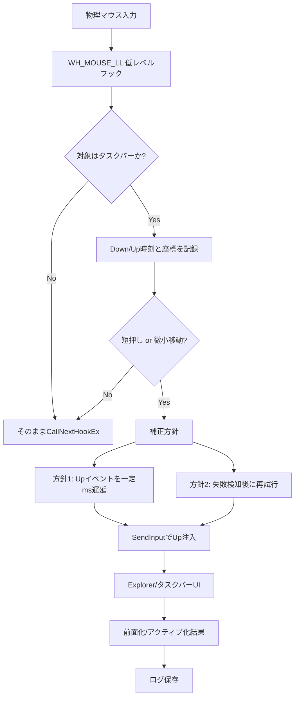
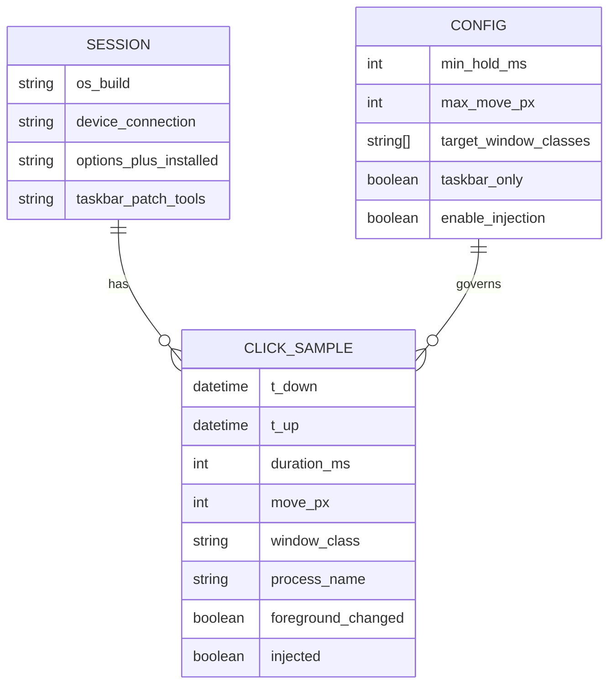

# Windows 11で「短い押下だとタスクバーの別アプリがアクティブにならない」問題の調査報告とOSS対策案

## エグゼクティブサマリ

Windows 11で「タスクバー上の別アプリ（または同一アプリの別ウィンドウ）をクリックしても前面化・アクティブ化しない/反応が不安定」という報告は、Microsoftコミュニティ（Microsoft Q&A）、Stack Exchange系（Super User）、Reddit等で複数年にわたり観測されます。典型例は「複数ウィンドウがあるとタスクバーから選んでも前面化しない」「何度かクリックしないと切り替わらない」「Win+Tabでは切り替えられる」等です。citeturn5view1turn5view2turn5view3

一方、ユーザー体感の「短い押下だと失敗し、少し長めに押すと成功しやすい」は、必ずしも“押下時間そのもの”が原因とは限らず、**押下中にカーソルがわずかに移動してクリック判定がキャンセルされる**（特にトラックボールや高DPI環境で起きやすい）可能性が高いです。Windowsにはドラッグ開始判定の「ドラッグ矩形（許容移動量）」があり、これを超えるとドラッグ操作として扱われやすくなります（`SM_CXDRAG/SM_CYDRAG`、および `SPI_SETDRAGWIDTH/SPI_SETDRAGHEIGHT`）。citeturn8search2turn8search13turn9view2turn9view3

対策は大きく二系統に整理できます。  
(1) **OS設定で“クリック許容領域（ドラッグ開始閾値）”を調整**し、短押しでの“ズレ”を起こしにくくする（侵襲性が低く、MVPとして最優先）。citeturn9view2turn9view3turn8search2  
(2) **ユーザーモードのOSSで低レベルフック（WH_MOUSE_LL）を用い、タスクバー上のクリックを補正**（短押し＝即UPを少し遅延させる、あるいは失敗検知後に再試行する）。Microsoft公式ドキュメント上、低レベルマウスフックや入力注入（SendInput）、注入イベント判定フラグ（`LLMHF_INJECTED`）は実装可能で、AutoHotkey v2でも叩き台を作れます。citeturn2search0turn21search0turn21search6

ハードウェア/常駐ソフト面では、MX Ergo SはBluetoothまたはLogi Boltで接続でき、Logi Options+の導入が推奨されています。citeturn22search0turn22search8 ただしOptions+自体はボタン割当やジェスチャーなどを提供する一方、左/右クリックの“押下時間しきい値”を明示的に調整する機能は公式説明では前面に出ていません。citeturn22search25turn6search0 また、旧「Logitech Options」はサポート終了・非メンテ状態と明記されています。citeturn22search3

---

## 症状の整理と既報の状況

### 既報の症状パターン

ユーザー報告を症状別に分けると、少なくとも次の二群が混在します（同一環境で両方起こる可能性もあります）。

**タスクバーからの前面化/アクティブ化が失敗する（UIは反応しているように見える）**  
* 複数のFile Explorerウィンドウ等がある状態で、タスクバーのプレビューから選んでも前面に出てこない/背面に残る（Win+Tabでは選べる）。citeturn5view1  
* 既に開いているアプリをタスクバーでクリックしても前面化せず、Alt+Tabでしか切り替えられない／何度もクリックが必要。citeturn5view2turn5view3  

**“短いクリック”で起きるように見える（押す長さを意識すると改善する、という体感）**  
* これは既報スレッドに明示されないことも多いですが、クリックが「短い」と失敗しやすいという記述は、実際には「押下～解放の間にカーソルが僅かに動いている」など別要因が“押下時間”に見えている可能性があります（後述）。この切り分けが本件で重要です。citeturn8search2turn9view2turn9view3  

### 公式アナウンスとの関係

entity["company","Microsoft","software company"]は2026年3月のWindows Insider Blogで「Windows 11の品質（性能・信頼性・クラフト）を引き上げる」計画を表明し、改善の具体例として「タスクバーのカスタマイズ増（上/左右への移動）」や「ファイルエクスプローラーの高速化・信頼性向上」、Feedback Hubの大型アップデート等を挙げています。citeturn5view0  
ただし、**本件“短い押下でタスクバー切替が失敗する”症状を名指しで認めた公式の既知の問題・修正予定**は、公開情報としては確認できません（少なくとも今回参照した公式ページ群には出てきません）。未指定扱いとします。

---

## 再現条件と切り分け設計

本件は「タスクバー限定の現象」なのか、「クリック判定（座標/時間/注入/フォーカス制御）の一般問題」なのかで、最適な対策が変わります。よって、OSS化の前に**“どの条件で失敗するか”を構造化して採取**する設計が必要です。

### 収集すべき属性と未指定項目

ユーザー要望に沿って、以下を必須属性（未指定なら未指定と明記）として扱います。

| 観点 | 具体項目 | なぜ必要か |
|---|---|---|
| 対象範囲 | タスクバーのみ / 他UI（スタート、通知領域、アプリ内ボタン）でも発生 | タスクバー固有（Explorer/タスクバーUI）問題か、クリック一般問題かを分離するため。citeturn6search3turn8search2 |
| OS | Windows 11のエディション・ビルド番号（例: 22000系、22621系、26100系など） | 既報ではビルド依存・アップデート起点を示唆する話があるため。citeturn5view3turn24view0 |
| 常駐ソフト | Logi Options+の有無、タスクバー改変（ExplorerPatcher/Windhawk等）の有無 | 入力フックやExplorerパッチ系は症状の誘発・悪化・別症状化のリスク。citeturn11search1turn4search26turn11search5turn7search16 |
| デバイス接続 | Bluetooth / Logi Bolt / Unifying / USB有線（※MX Ergo Sは無線） | 無線層の遅延・省電力・デバイス別挙動の切り分け。MX Ergo SはBluetoothまたはLogi Boltが公式。citeturn22search0turn22search8 |
| 他マウス再現 | ERGO M575等、別個体・別方式で再現するか | 個体差（スイッチ/チャタリング）とOS/UI問題の分離。citeturn1search18turn15view1 |

現時点では、あなたの環境について **Windowsビルド、Logi Options+有無、接続方式、他マウスでの再現** が未指定です（未指定）。

### 再現テストケース

再現を「クリック対象」と「ウィンドウ状態」で分け、失敗率を計測します。

* タスクバーの単一ウィンドウ（アイコンをクリック → 前面化するか）  
* タスクバーの複数ウィンドウ（アイコン→サムネイル選択 → 前面化するか）citeturn5view1turn5view2  
* 最小化ウィンドウ（最小化→タスクバークリックで復帰するか）  
* 高負荷/軽負荷（Explorer/対象アプリが重いと失敗率が変わるか）  
  * “処理遅延・レース”仮説の評価に必要です。RudeWindowFixerの調査でも、最小化復帰の際に `WM_WINDOWPOSCHANGING` 処理遅延が絡むレースが説明されています。citeturn25view0turn24view0  

### 計測方法（イベントタイムスタンプ、ログ）

OSSプロトタイプは、まず**観測（ログ）**を重視します。最低限のログは次です。

* マウスダウン時刻・マウスアップ時刻（ミリ秒）  
* ダウン→アップ間のカーソル移動量（px）  
* クリック対象のウィンドウクラス（例: `Shell_TrayWnd` 等）  
* フォアグラウンドウィンドウ（クリック前/後で変化したか）  
* （可能なら）入力が物理か注入か（`MSLLHOOKSTRUCT.flags` の `LLMHF_INJECTED` 判定）citeturn21search6  

デバイス識別までやる場合はRaw Input APIを併用し、`WM_INPUT` から `RAWINPUTHEADER.hDevice` を取り、`GetRawInputDeviceInfo` で個体を区別できます。citeturn21search1turn21search8turn21search5

---

## 入力処理の技術的背景と原因仮説

### 仮説の全体像

本件を「“押下時間”問題」と断定すると外しやすいため、以下の仮説を並行で扱うのが合理的です。

**仮説A：押下中の“微小移動”でクリック扱いが成立しない（短押しほど起きやすく見える）**  
Windowsはドラッグ開始検出のために「マウスダウン点から一定ピクセル以内はドラッグ開始と見なさない」という閾値（ドラッグ矩形）を持ちます。`SM_CXDRAG/SM_CYDRAG` はその意味を明記しています。citeturn8search2  
ドラッグ矩形の大きさは `SystemParametersInfo` の `SPI_SETDRAGWIDTH/SPI_SETDRAGHEIGHT` で変更可能です。citeturn9view2turn9view3  
トラックボールや高DPIでは、押下の瞬間に微小移動が入りやすく、**短押し＝“ダウン時点ではアイコン上、アップ時点では僅かに外れた”** が起きると、アプリ側/シェル側のクリック確定がキャンセルされやすい、という説明がつきます（この部分は推論）。

**仮説B：Explorer/タスクバーUI側のフォーカス/前面化が不安定（既報あり）**  
「タスクバーから選ぶと前面化しないがWin+Tabだとできる」という報告は複数あります。citeturn5view1turn5view3  
また、タスクバー周辺の内部挙動は歴史的に回帰やレースが起きうることが、RudeWindowFixerの調査（別症状：常に手前表示の崩壊）でも示されています。特に「最小化復帰時に `HSHELL_WINDOWACTIVATED` と `WM_WINDOWPOSCHANGING` のレースで状態がズレる」説明は、**“タイミング依存”**を裏付けます。citeturn25view0turn24view0  
この系統は押下時間に敏感に見える可能性があります（押している間に内部状態が追いつく、等）。

**仮説C：常駐ソフト（入力フック/Explorer改変）が劣化させる**  
ExplorerPatcherはExplorerを終了してパッチ適用するタイプのシェル改変で、GitHubのリリースページ自体が「公式配布はこのページのみ」「他所はマルウェアの可能性」と注意喚起しています。citeturn11search5turn11search1  
WindhawkもUI改変をモジュールで行う仕組みで、ビルドやコンパイラ更新に伴う互換性調整が発生しうる旨がリリースノートに含まれます。citeturn4search26  
これらは本件の原因にも、回避策にもなり得るため、まず“導入有無”を計測属性に含めるべきです。

### 「クリック押下時間」をOSが直接設定させない理由の整理

Windowsの公開設定で調整しやすいのは、たとえば以下です。

* ダブルクリック時間：`SPI_SETDOUBLECLICKTIME` で設定可能。citeturn9view0  
* ダブルクリック矩形（クリック位置許容）：`SPI_SETDOUBLECLKWIDTH/HEIGHT`。citeturn9view0  
* ドラッグ開始矩形（押下中の許容移動）：`SPI_SETDRAGWIDTH/HEIGHT`。citeturn9view2turn9view3  

一方、「単クリックは何ミリ秒以上押さないと無効」というような“クリック時間しきい値”は、少なくともMicrosoftが公開している `SystemParametersInfo` の主要パラメータ群には見当たりません（クリック確定が時間ではなく、位置・状態遷移（down/up）で定義される設計が一般的なため、というのが妥当な解釈ですが、ここは推論）。

---

## 対策アプローチとOSS現状

### 実装方式の比較

| 方式 | 何をするか | 長所 | 主な欠点/制約 | 適合度 |
|---|---|---|---|---|
| OS設定でドラッグ閾値を上げる | `SPI_SETDRAGWIDTH/HEIGHT` で“押下中の微小移動”に強くする citeturn9view2turn9view3 | 侵襲性が低い・常駐不要・説明可能 | ドラッグ操作が重くなる（副作用） | 最優先の一次対策 |
| AutoHotkey v2（ユーザーモード） | WH_MOUSE_LLでdown/upを観測し、タスクバー上の短押しを補正（UP遅延/再注入） citeturn2search0turn21search6 | 最短でプロトタイピング可能、配布容易 | フック遅延で体感劣化、注入はUIPI制約 citeturn21search0 | MVP向き |
| C++ WinAPI（ユーザーモード） | WH_MOUSE_LL + SendInput（より堅牢・高性能） citeturn2search0turn21search0 | 低レイテンシ、ログ/分析が強い | 実装・署名・配布負担、ウイルス誤検知リスク | 公開版向き |
| Explorer改変（Windhawk/ExplorerPatcher系） | Explorerのタスクバー挙動自体をフック/差し替え | 問題がタスクバー固有なら根治に近い | 仕様変更に弱い、互換性コスト高 citeturn4search26turn11search5 | 上級者向き |
| ドライバ層（KMDFフィルタ） | カーネルでマウス入力を補正（Moufiltr等） citeturn12search1turn12search6 | 最も低レベルで確実な補正が可能 | 署名/配布/保守が重い、失敗時の影響大 | 本件では最終手段 |

### 既存OSSの現状（更新・互換性・ライセンス）

ここでは「本件にそのまま効く」ものと、「実装参考になる」ものを分けます。

**クリック/ドラッグの補正に近い（参考にも代替にもなりうる）**  
* MouseFix：誤クリック（チャタリング）やドラッグの途切れ等の補正をうたう。最新版v1.0.3が2026年1月に更新されており、MITライセンス明記。citeturn15view1  
  * 本件が“短押し＝微小移動＝ドラッグ誤判定/クリック不成立”寄りなら、アプローチ（Smart Drag等）の発想は参考になります。citeturn15view1  
* Mouse-Debouncer：誤ダブルクリック抑制のトレイアプリ。MITライセンス明記、Windows 10でテストと記載。公開日時の年は取得できず未指定（GitHub表示が年なしのため）。citeturn18view0turn17view0turn11search3  

**タスクバー不具合の“タイミング依存”を扱う参考資料**  
* RudeWindowFixer：症状自体は「タスクバーが常に手前にならない」ですが、Windows 11でのレース・回帰・内部挙動を詳細に解析し、固定遅延（50ms）で“再計算を促す”回避策を採る、と説明しています。citeturn24view0turn25view0  
  * 重要なのは、**タスクバークリックや最小化復帰が“タイミングに敏感”な経路を含み得る**という点です（本件の“短押しが効かない”体感と整合する場合があります）。citeturn25view0  
  * ライセンスは、今回取得できた範囲ではリポジトリ表示上に明示が見当たりません（未指定）。citeturn24view0turn25view0  

**Explorer/タスクバー改変の実運用例（ただし副作用も大きい）**  
* Windhawk：2025年末時点のリリースで、API・コンパイラ更新と互換性配慮が記載。citeturn4search26  
  * 公式mod集は、ライセンス未指定modはMIT扱いと説明。citeturn4search22  
* ExplorerPatcher：GPL-2.0。2025年11月のリリースが確認でき、配布経路に注意喚起あり。citeturn11search0turn11search5  

なお、ロジクール系常駐ソフトの代替として注目されるMouser（MIT）は「Options+代替」を目的にしており、入力フックやデバイス処理の実装例としては参考になりますが、本件の“タスクバー前面化”に直接効くとは限りません。citeturn14search4turn14search2

---

image_group{"layout":"carousel","aspect_ratio":"16:9","query":["Logitech MX Ergo S trackball mouse","Windows 11 taskbar icons"],"num_per_query":1}

## 推奨するプロトタイプ設計

### 目標の切り方

最短で価値が出る順に、プロトタイプを二段階に分けるのが現実的です。

* **観測MVP**：失敗の瞬間に「押下時間」「押下中移動」「対象（タスクバーか）」「前面化の成否」をログ化。原因仮説A/B/Cをデータで潰す。  
* **補正MVP**：観測で有意だった因子に対して最小介入で補正する。  
  * 仮説Aが強いなら：OS設定（`SPI_SETDRAGWIDTH/HEIGHT`）か、タスクバー上のみ“UPを少し遅延”  
  * 仮説Bが強いなら：“失敗したら遅延後に再試行”（ただし前面化APIは制約が強い）citeturn9view4turn21search0  

### イベントフロー図（mermaid）



補正で「注入」を使う場合、`SendInput`はUIPI（整合性レベル）制約があることを前提にします。citeturn21search0turn21search3

### データモデル図（mermaid ER）



---

## 最短実装サンプルとテスト手順

### まず効きやすい“非OSS/低侵襲”の一次対策（根が仮説Aなら最短）

ドラッグ開始矩形の調整（`SPI_SETDRAGWIDTH/HEIGHT`）は公開APIで可能です。citeturn9view2turn9view3  
この値を少し上げることで、押下中の微小移動で“クリックが成立しない”状況が改善する場合があります（効果は環境依存）。副作用としてドラッグ開始が鈍くなる点に注意します。citeturn8search2turn9view2turn9view3

### AutoHotkey v2 叩き台

以下は「観測MVP＋（条件付きで）タスクバー上の短押しUPを遅延注入する」最短の叩き台です。  
仕組み上、低レベルフック（WH_MOUSE_LL）でイベントを監視し、注入イベントは `MSLLHOOKSTRUCT.flags` の `LLMHF_INJECTED` で自己ループ回避します。citeturn2search0turn21search6  
また、注入は `SendInput` 相当の操作になるため、UIPI制約（高整合性プロセスには注入できない等）を受けます。citeturn21search0turn21search3

```autohotkey
#Requires AutoHotkey v2.0
#SingleInstance Force

; ---------------------------------------------
; Config
; ---------------------------------------------
global MIN_HOLD_MS := 40          ; ここを調整（例: 20〜80ms）
global MAX_MOVE_PX := 6           ; 押下中の移動がこれ以下のときだけ補正
global TASKBAR_ONLY := true
global LOG_PATH := A_ScriptDir "\taskbar_click_log.csv"

; CSV header
if !FileExist(LOG_PATH)
    FileAppend("t_down,t_up,duration_ms,move_px,root_class,fg_changed,injected`n", LOG_PATH, "UTF-8")

; ---------------------------------------------
; Hook setup
; ---------------------------------------------
global gHook := 0
global gCb := 0

global gDownTick := 0
global gDownX := 0, gDownY := 0
global gInjectedGuard := false

StartHook()
OnExit(StopHook)

StartHook() {
    global gHook, gCb
    gCb := CallbackCreate(LowLevelMouseProc, , 3) ; nCode, wParam, lParam
    gHook := DllCall("user32\SetWindowsHookExW"
        , "Int", 14 ; WH_MOUSE_LL
        , "Ptr", gCb
        , "Ptr", DllCall("kernel32\GetModuleHandleW", "Ptr", 0, "Ptr")
        , "UInt", 0
        , "Ptr")
    if !gHook
        MsgBox "SetWindowsHookEx failed. A_LastError=" A_LastError
}

StopHook(*) {
    global gHook, gCb
    if gHook
        DllCall("user32\UnhookWindowsHookEx", "Ptr", gHook)
    if gCb
        CallbackFree(gCb)
}

; ---------------------------------------------
; Helpers
; ---------------------------------------------
IsOnTaskbarRootClass(rootClass) {
    return (rootClass = "Shell_TrayWnd" || rootClass = "Shell_SecondaryTrayWnd")
}

GetRootWindowClassAt(x, y) {
    ; WindowFromPoint takes POINT by value: pack x/y into Int64
    hwnd := DllCall("user32\WindowFromPoint", "Int64", (y << 32) | (x & 0xFFFFFFFF), "Ptr")
    if !hwnd
        return ""

    ; GA_ROOT = 2
    hRoot := DllCall("user32\GetAncestor", "Ptr", hwnd, "UInt", 2, "Ptr")
    if !hRoot
        hRoot := hwnd

    buf := Buffer(256 * 2, 0)
    n := DllCall("user32\GetClassNameW", "Ptr", hRoot, "Ptr", buf, "Int", 256, "Int")
    return (n > 0) ? StrGet(buf, n, "UTF-16") : ""
}

GetForegroundHwnd() {
    return DllCall("user32\GetForegroundWindow", "Ptr")
}

InjectLButtonUp() {
    ; AHKのClickは内部的に注入入力になる。フック側でLLMHF_INJECTEDを見て自己ループ回避する。
    Click "Up"
}

CsvEscape(s) {
    if InStr(s, ",") || InStr(s, '"') {
        s := StrReplace(s, '"', '""')
        return '"' s '"'
    }
    return s
}

; ---------------------------------------------
; Hook callback
; ---------------------------------------------
LowLevelMouseProc(nCode, wParam, lParam) {
    static WM_LBUTTONDOWN := 0x0201
    static WM_LBUTTONUP   := 0x0202
    static LLMHF_INJECTED := 0x00000001

    if (nCode < 0)
        return DllCall("user32\CallNextHookEx", "Ptr", 0, "Int", nCode, "Ptr", wParam, "Ptr", lParam, "Ptr")

    x := NumGet(lParam, 0, "Int")
    y := NumGet(lParam, 4, "Int")
    flags := NumGet(lParam, 12, "UInt")
    injected := (flags & LLMHF_INJECTED) != 0

    ; 自分が注入したUpはスキップ（無限ループ防止）
    if injected
        return DllCall("user32\CallNextHookEx", "Ptr", 0, "Int", nCode, "Ptr", wParam, "Ptr", lParam, "Ptr")

    global gDownTick, gDownX, gDownY
    global MIN_HOLD_MS, MAX_MOVE_PX, TASKBAR_ONLY, LOG_PATH

    if (wParam = WM_LBUTTONDOWN) {
        gDownTick := A_TickCount
        gDownX := x, gDownY := y
        return DllCall("user32\CallNextHookEx", "Ptr", 0, "Int", nCode, "Ptr", wParam, "Ptr", lParam, "Ptr")
    }

    if (wParam = WM_LBUTTONUP) {
        tUp := A_TickCount
        duration := (gDownTick > 0) ? (tUp - gDownTick) : 0
        dx := x - gDownX, dy := y - gDownY
        move := Round(Sqrt(dx*dx + dy*dy))

        rootClass := GetRootWindowClassAt(x, y)

        fgBefore := GetForegroundHwnd()
        ; （ここで本当は“クリック結果”を判定したいが、確定は難しいので簡易に前後変化を見る）
        ; 実運用では、Up後に短い遅延を入れてから再取得するほうが安定する。

        doFix := false
        if (duration > 0 && duration < MIN_HOLD_MS && move <= MAX_MOVE_PX) {
            if (!TASKBAR_ONLY || IsOnTaskbarRootClass(rootClass))
                doFix := true
        }

        if doFix {
            ; Upを一旦握りつぶして、MIN_HOLD_MSに達するまで遅延してUpだけ注入
            delay := MIN_HOLD_MS - duration
            SetTimer(InjectLButtonUp, -delay)
            fgAfter := GetForegroundHwnd()

            FileAppend(
                A_Now "," A_Now "," duration "," move "," CsvEscape(rootClass) "," (fgAfter!=fgBefore) "," injected "`n"
                , LOG_PATH, "UTF-8"
            )
            gDownTick := 0
            return 1
        } else {
            fgAfter := GetForegroundHwnd()
            FileAppend(
                A_Now "," A_Now "," duration "," move "," CsvEscape(rootClass) "," (fgAfter!=fgBefore) "," injected "`n"
                , LOG_PATH, "UTF-8"
            )
            gDownTick := 0
        }
    }

    return DllCall("user32\CallNextHookEx", "Ptr", 0, "Int", nCode, "Ptr", wParam, "Ptr", lParam, "Ptr")
}
```

このスクリプトは“叩き台”であり、実運用品質にするには少なくとも「前面化の成否判定」「タスクバー内の対象限定（開始ボタン/通知領域等を除外）」「多モニタ」「右クリック版」「例外処理」「フック遅延最適化」等が必要です（詳細は次節のタスクリスト参照）。

### テスト手順（MVP→公開版）

**再現テスト**  
1) 対象アプリを「単一ウィンドウ」「複数ウィンドウ」「最小化」状態で用意。citeturn5view1turn5view2  
2) “短押しを意識せず”にタスクバー切替を20〜50回繰り返し、失敗回数を記録。  
3) AHK観測ログの `duration_ms` と `move_px` の分布を確認し、「失敗時はmoveが大きい」等の相関があるかを見る。  
4) もし“move相関”が強いなら、`SPI_SETDRAGWIDTH/HEIGHT` を段階的に上げて（例: 4→12→20→30）失敗率を再計測。citeturn9view2turn9view3turn8search2  
5) もし“move相関が弱く、短押し（duration）のみで失敗が増える”なら、UP遅延補正（MIN_HOLD_MS）を段階調整（20→40→60ms）し、体感と失敗率のトレードオフを測る。

---

## OSS公開計画と参考ソース

### 推奨ライセンスとライセンス上の注意

OSSとして広く使ってもらう目的なら、**MITまたはApache 2.0**が無難です（採用しやすく、派生も出やすい）。ただし、Explorer改変系や一部ツールはGPL系です（ExplorerPatcherはGPL-2.0、7+ Taskbar TweakerはGPL-3.0）。GPLコードを参照・流用すると派生物のライセンスが拘束されるため、**実装はMicrosoft公式ドキュメントと自前コードを主軸**にし、GPLプロジェクトのコード流用は避けるのが安全です。citeturn11search0turn7search1turn9view0turn2search0  
Windhawkの公式mod集は、ライセンス未指定modはMITとして投稿される旨が書かれており、モジュール単位の公開もしやすいです。citeturn4search22

### READMEテンプレ要点（公開版で必要になる情報）

* 何が起きる問題か（再現動画/ログ例）  
* どの方式で直すか（ドラッグ閾値調整 or フック補正）  
* 既知の副作用（ドラッグの重さ、UIPI、誤検知、互換性）citeturn21search0turn11search5turn8search2  
* サポート対象（Windowsビルド範囲は現実的に絞る）  
* アンインストール・無効化手順（常駐系は重要）

### 優先度付きタスクリストと概算

前提：1人開発、Windowsのデスクトップアプリ/スクリプト開発経験あり、CIはGitHub Actions想定（概算は工数の目安）。

| 優先 | タスク | 成果物 | 見積 |
|---|---|---|---|
| 高 | 観測MVP（AHK） | duration/move/root_class/fg変化をCSVログ | 半日〜1日 |
| 高 | 再現マトリクス整備 | OSビルド/接続/Options+有無/他マウスの結果表 | 0.5日 |
| 高 | 一次対策（ドラッグ閾値ツール） | `SPI_SETDRAGWIDTH/HEIGHT` を設定/復元するCLI/スクリプト | 0.5〜1日 citeturn9view2turn9view3 |
| 中 | 補正MVP（タスクバー上のみUP遅延） | AHKで安定動作、除外領域も実装 | 1〜3日 |
| 中 | C++版プロトタイプ（WH_MOUSE_LL） | 高性能ロガー＋補正、署名なし配布（自己責任） | 3〜7日 citeturn2search0turn21search0turn21search6 |
| 中 | Raw Input併用でデバイス識別 | hDevice→デバイス名/VID/PIDログ | 2〜4日 citeturn21search1turn21search8turn21search5 |
| 低 | Windhawk modでのExplorer側パッチ検討 | “タスクバーUI固有バグ”に寄せた根治系 | 1〜3週間（保守含む）citeturn4search26turn4search22 |
| 低 | ドライバ層（KMDFフィルタ） | Moufiltrベースの入力補正ドライバ | 数週間〜（署名/検証が重い）citeturn12search1turn12search6 |

### 参考ソース一覧（優先度順）

**Microsoft公式（仕様・制約の根拠）**  
* Windows品質改善コミット（Windows Insider Blog）citeturn5view0  
* 低レベルマウスフック：`WH_MOUSE_LL` / `LowLevelMouseProc` / `MSLLHOOKSTRUCT` と注入フラグ `LLMHF_INJECTED` citeturn2search0turn21search6  
* 入力注入：`SendInput` とUIPI制約 citeturn21search0turn21search3  
* ドラッグ開始閾値：`SM_CXDRAG/SM_CYDRAG`、設定：`SPI_SETDRAGWIDTH/SPI_SETDRAGHEIGHT` citeturn8search2turn9view2turn9view3  
* Raw Input（デバイス識別・高精度計測）citeturn21search1turn21search5turn21search8  
* ドライバ層（最終手段）：Moufiltrサンプル、HIDドライバ解説 citeturn12search1turn12search6  

**Logitech公式（デバイス仕様・制限）**  
* MX Ergo S 接続方式（Bluetooth/Logi Bolt）とOptions+推奨 citeturn22search0turn22search8  
* MX Ergo Sの製品仕様（静音クリック、6ボタン、USB-C等）citeturn22search2  
* 旧Logitech Optionsはサポート終了（非メンテ）citeturn22search3  
* Logi Options+ 機能概要（ジェスチャー/ポインタ調整など）citeturn22search25turn6search0  

**主要GitHub（実装参考・互換性/ライセンス）**  
* ExplorerPatcher（GPL-2.0、公式配布注意）citeturn11search0turn11search5  
* Windhawk（リリースノート、mod集のライセンス方針）citeturn4search26turn4search22  
* MouseFix（MIT、近年更新、ドラッグ/クリック補正の考え方が近い）citeturn15view1  

**関連フォーラム/StackExchange（既報収集）**  
* Super User：Windows 11でタスクバークリックが前面化しない既報 citeturn5view2  
* Microsoft Q&A：タスクバーからの選択で前面化しない既報 citeturn5view1  

不明点（あなたの環境のWindowsビルド、接続方式、Options+有無、他マウス再現性）が確定すると、上記のどの仮説が本命か、そしてOSSの最短MVPを「ドラッグ閾値ツール」に寄せるべきか「タスクバーUP遅延ツール」に寄せるべきかを、ログベースで判断できます。